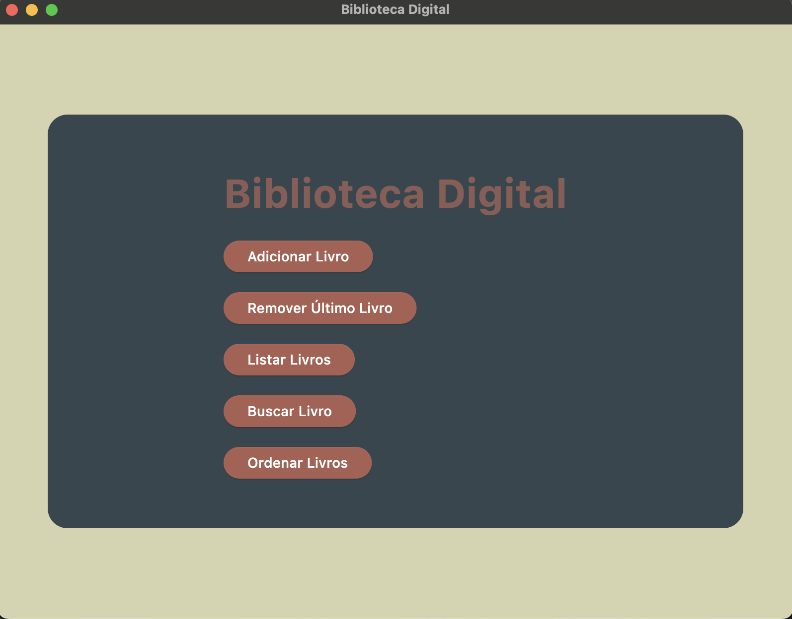

# App para disciplina de Estrutura de Dados



Este é um projeto de uma biblioteca digital, desenvolvido para a disciplina de Estrutura de Dados. O projeto consiste em uma aplicação que permite aos usuários gerenciar uma coleção de livros. Além disso, inclui funcionalidades para classificar e pesquisar livros, além de permitir a adição, remoção e edição de livros na biblioteca. As estruturas presentes foram implementadas por mim, seguindo os ensinamentos e requisitos da disciplina. O mesmo para os algoritmos de ordenação e busca, no qual tive acesso a informações também através do livro 'Entendendo Algoritmos: Um Guia Ilustrado'.

## Estrutura do Projeto

- `main.py`: Arquivo principal que inicia a aplicação.
- `src/models/book.py`: Classe que representa um livro.
- `src/data_structures`: Pasta que contém as implementações das estruturas de dados utilizadas. **No momento, apenas a lista sequencial está implementada.**
- `src/sorting_algorithms`: Pasta que contém as implementações dos algoritmos de ordenação utilizados. **Até o fim do projeto pretendo implementar outros algoritmos de ordenação.**
- `src/ui`: Pasta que contém a interface do usuário e a lógica de interação com o usuário, como a busca por livros, a adição de livros, a remoção de livros e a edição de livros, além da própria interface com os respectivos popups contendo os respectivos formulários para cada operação.

## Como Rodar o Projeto

Para executar o projeto, siga as etapas abaixo:

1. Certifique-se de ter o Python instalado. Caso contrário, baixe e instale a partir do [site oficial do Python](https://www.python.org/downloads/).
2. Clone o repositório em seu ambiente de desenvolvimento.
3. Crie um ambiente virtual (opcional, mas recomendado):
- python -m venv .venv
4. Ative o ambiente virtual:
- No Windows:
  ```
  .venv\Scripts\activate
  ```
- No MacOS/Linux:
  ```
  source .venv/bin/activate
  ```
5. Instale as dependências do projeto:
    ```
    pip install -r requirements.txt
    ```
6. Execute o aplicativo:
    ```
    flet -r main.py
    ```

## Bibliotecas e linguagens utilizadas

- [Python](https://www.python.org/): Linguagem de programação utilizada.
- [Flet](https://flet.dev/docs/): Biblioteca utilizada para a interface do usuário.
